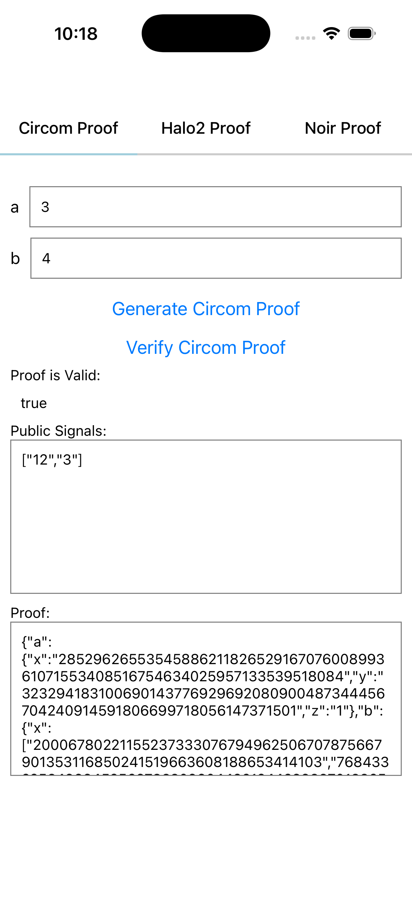
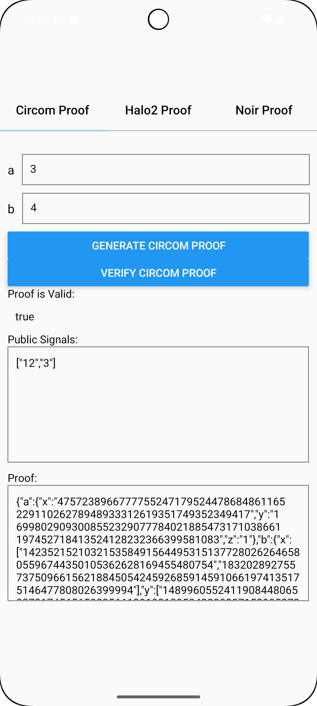

# Mopro React Native App with Expo framework

This is a sample [Expo](https://expo.dev) app that demonstrates how mopro can be used to prove a `multiplier2` circuit.

Learn more about Mopro: https://zkmopro.org.

## Get started

### Prerequisites

Use node.js >= `20`

```sh
nvm use 20
```

### 1. Install dependencies

```bash
npm install
```

### 2. Start the app

- setup the `ANDROID_HOME` environment

    ```bash
    export ANDROID_HOME=~/Library/Android/sdk
    ```

    start an android emulator/device

    ```bash
    npm run android
    ```

- start an iOS simulator

    ```bash
    npm run ios
    ```

    To run the app on a real iOS device, open the Xcode workspace:

    ```bash
    open ios/MyTestLibraryExample.xcworkspace
    ```

    Then, in Xcode, select your project in the sidebar, go to **Signing & Capabilities → Signing**, and choose your Apple account (team) under **Team**.

- start a web app

    ```bash
    npm run web
    ```

### 3. Update Mopro Bindings

- Get `MoproReactNativeBindings` through [Getting Started](https://zkmopro.org/docs/getting-started)
- Update the `MoproReactNativeBindings` folder

### 5. Use the React Native Module

- For example, in [`src/App.tsx`](src/App.tsx)

    ```ts
    import {
        CircomProofResult,
        generateCircomProof,
        ProofLib,
        verifyCircomProof,
    } from 'mopro-ffi';

    const circuitInputs = {
        a: ["3"],
        b: ["5"],
    };

    const res: CircomProofResult = await generateCircomProof(
        zkeyPath.replace("file://", ""),
        JSON.stringify(circuitInputs),
        ProofLib.Arkworks
    );

    const res: boolean = await verifyCircomProof(
        zkeyPath.replace("file://", ""),
        res,
        ProofLib.Arkworks
    );
    ```

<!-- TODO: integrate back e2e tests -->
<!-- ## E2E Tests

Run E2E Tests with [Detox](https://wix.github.io/Detox/)

### iOS

1. Start the development server

    ```sh
    npm run start
    ```

2. Verify the simulator matches your Detox config
   Check the simulator configuration in [`.detoxrc.js`](.detoxrc.js):
    ```js
    devices: {
        'ios.simulator': {
            type: 'ios.simulator',
            device: {
                type: 'iPhone 16 Pro', // Your device
                os: 'iOS 18.4' // OS version
            }
        }
    }
    ```
    To view available simulators on your machine, run:
    ```sh
    xcrun simctl list devices
    ```
3. Run the tests
    ```sh
    npm run e2e:test:ios
    ```

### Android

1. Start the development server

    ```sh
    npm run start
    ```

2. Verify the simulator matches your Detox config
   Check the simulator configuration in [`.detoxrc.js`](.detoxrc.js):
    ```js
    devices: {
        'android.emulator': {
            type: 'android.emulator',
            device: {
                avdName: 'Pixel_8_API_35' // Your device
            }
        }
    }
    ```
    To view available emulators on your machine, run:
    ```sh
    emulator -list-avds
    ```
3. Run build command
    ```sh
    npm run e2e:build:android
    ```
4. Run the tests
    ```sh
    npm run e2e:test:android
    ``` -->

## Screenshots

### iOS



### Android



<!-- TODO: add web support -->